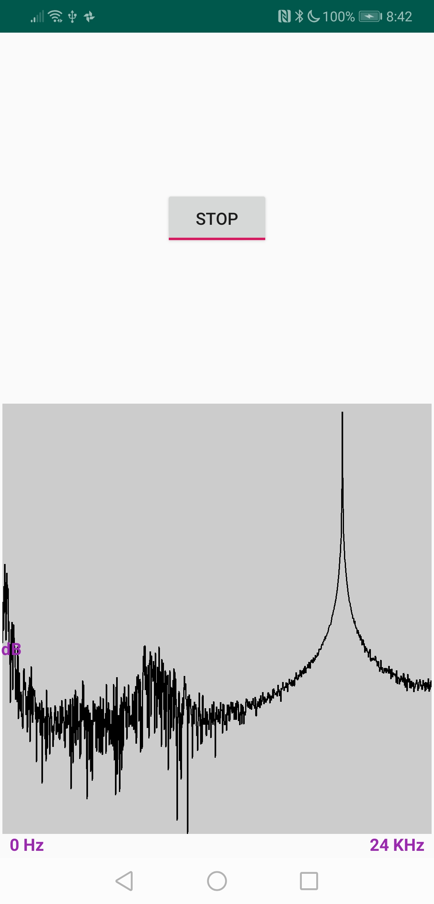

# dtc-acoustic-spectrumer

[](https://opensource.org/licenses/MIT)&nbsp;
[](https://www.codacy.com/app/dtczhl/dtc-acoustic-spectrumer?utm_source=github.com&amp;utm_medium=referral&amp;utm_content=dtczhl/dtc-acoustic-spectrumer&amp;utm_campaign=Badge_Grade)

A simple android app to display the spectrum of received sounds

## Screenshot



Screenshot from Huawei Mate 20. You can see that there is a spike around 19 KHz when I send sounds of that frequency. See my [dtc-frequency-player](https://github.com/dtczhl/dtc-frequency-player) about how to send sounds of a specific frequency.

Ranges:
*   x-axis (horizontal): \[0Hz, 24 KHz\]
*   y-axis (vertical): strength of frequency in dB

## Source Code

The interface to the spectrum analysis is the `AnalyzeFrequency.java` class. The spectrum range is \[0 Hz, 24 KHz\].

1.  start frequency analysis
```java
  AnalyzeFrequency mFftAnalysis = new AnalyzeFrequency(mHandler, mRun);
  mFftAnalysis.start();

  //  FFT magnitude for current frame of received sound.
  //  Default length: 4096/2-1
  mFftAnalysis.mMagnitude
```

2.  stop frequency analysis
```java
  if (mFftAnalysis != null) {
      mFftAnalysis.stop();
      mFftAnalysis = null;
  }
```

Some critical steps to create this Android app from scratch.

1.  download the source code of Apache Commons Math library for Java that includes Fast-Fourier-Transform (FFT). <http://commons.apache.org/proper/commons-math/download_math.cgi>

2.  extract the downloaded file. Goes to `commons-math3-***/src/main/java/org/apache/commons/math3`, remove the `geometry` folder which is not compatible with Android.

3.  goes to `commons-math3-***/src/main/java/` and copy the `org` folder to your Android project `app/src/main/`

4.  enable Android permission `<uses-permission android:name="android.permission.RECORD_AUDIO" />`

## Phones Tested
*   Huawei Mate 20
*   Google Pixel 2
